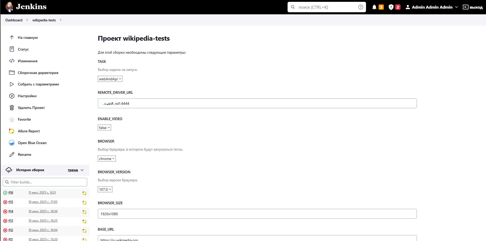

<h1 align="center">Проект по автоматизации тестирования проекта Wikipedia</h1>
<p align="center">
<a href="https://ru.wikipedia.org/"></a>
</p>

>Википе́дия (англ. Wikipedia) — общедоступная многоязычная универсальная интернет-энциклопедия со свободным контентом, 
>реализованная на принципах вики. Википедия является международным проектом, который состоит из языковых разделов.

##  Содержание:
- <a href="#stack"> Технологии и инструменты</a>
- <a href="#cases"> Тест-кейсы</a>
- <a href="#autotests"> Запуск автотестов</a>
- <a href="#jenkins"> Сборка в Jenkins</a>
- <a href="#allureReport"> Отчет о результатах тестирования в Allure Report</a>
- <a href="#selenoid"> Пример запуска теста в Selenoid</a>
- <a href="#tg"> Уведомления в Telegram с использованием бота</a>

____
<a id="stack"></a>
## :rocket: Технологии и инструменты

<p align="left">
  <code><a href="https://www.w3schools.com/java/"></a></code>
  <code><a href="https://www.jetbrains.com/idea/"></a></code>
  <code><a href="https://gradle.org/"></a></code>
  <code><a href="https://ru.selenide.org/"></a></code>
  <code><a href="https://rest-assured.io/"></a></code>
  <code><a href="https://junit.org/junit5/docs/current/user-guide/"></a></code>
  <code><a href="https://appium.io/docs/en/latest/"></a></code>
  <code><a href="https://developer.android.com/studio?hl=ru"></a></code>
  <code><a href="https://www.jenkins.io/"></a></code>
  <code><a href="https://aerokube.com/selenoid/"></a></code>
  <code><a href="https://www.docker.com/"></a></code>
  <code><a href="https://git-scm.com/"></a></code>  
  <code><a href="https://github.com/"></a></code>
  <code><a href="https://allurereport.org/"></a></code>
  <code><a href="https://t.me/telegram"></a></code>
</p>

>*<code><strong>*Java*</strong></code> - это язык программирования, на котором написаны тесты.*
>
>*<code><strong>*IntelliJ IDEA*</strong></code> - это интегрированная среда разработки программного обеспечения для многих языков программирования, в частности Java, JavaScript, Python, разработанная компанией JetBrains.*
>
>*<code><strong>*Gradle*</strong></code> - это система автоматической сборки, построенная на принципах Apache Ant и Apache Maven, но предоставляющая DSL на языках Groovy и Kotlin вместо традиционной XML-образной формы представления конфигурации проекта.*
>
>*<code><strong>*Selenide*</strong></code> - это фреймворк для автоматизированного тестирования веб-приложений на основе Selenium WebDriver.*
>
>*<code><strong>*REST Assured*</strong></code> - это библиотека на основе Java для упрощения тестирования и валидации REST API. Она абстрагирует сложное взаимодействие по HTTP в интуитивно понятный синтаксис.*
>
>*<code><strong>*JUnit 5*</strong></code> - это фреймворк для написания и выполнения модульных тестов в языке программирования Java.*
>
>*<code><strong>*Appium*</strong></code> - это HTTP-сервер, написанный на node.js, который создает и обрабатывает несколько сессий WebDriver для различных платформ, таких как iOS и Android.*
>
>*<code><strong>*Android Studio*</strong></code> - это интегрированная среда разработки (IDE) для создания приложений под операционную систему Android (используется для запуска эмулятора устройства на Android).*
>
>*<code><strong>*Jenkins*</strong></code> - это система потоковой сборки для автоматизации всех видов задач, связанных с созданием, тестированием, доставкой или развёртыванием программного обеспечения.*
>
>*<code><strong>*Selenoid*</strong></code> - это легковесный сервер, разработанный для запуска изолированных браузеров в Docker контейнерах.*
>
>*<code><strong>*Docker*</strong></code> - это программное обеспечение для автоматизации развёртывания и управления приложениями в средах с поддержкой контейнеризации, контейнеризатор приложений.*
>
>*<code><strong>*Git*</strong></code> - это специальная программа, которая позволяет отслеживать любые изменения в файлах, хранить их версии и оперативно возвращаться в любое сохранённое состояние.*
>
>*<code><strong>*GitHub*</strong></code> - это облачная платформа для хостинга IT-проектов и совместной разработки, под капотом которой находится популярная система контроля версий Git, а также полноценная социальная сеть для разработчиков.*
>
>*<code><strong>*Allure Report*</strong></code> - это инструмент с открытым исходным кодом для создания интерактивных и подробных отчётов о тестировании.*
>
>*<code><strong>*Telegram Bot*</strong></code> - используются для визуализации результатов тестирования.*

____
<a id="cases"></a>
## :spiral_notepad: Тест-кейсы

### &nbsp;&nbsp;&nbsp;&nbsp;&nbsp;&nbsp; WEB

>- [x] *Отображение поля "Искать в Википедии" в навигационной панели после открытия главной страницы*
>- [x] *Отсутствие предложенных результатов после заполнения поля "Искать в Википедии" несуществующим значением*
>- [x] *Отображение заголовка страницы = "Википедия — свободная энциклопедия" при открытии главной страницы портала*
>- [x] *Отображение значения = "{value}" в предложенных результатах после заполнения поля "Искать в Википедии" (параметризованный тест)*
>- [x] *Успешная авторизация на портале*
>- [x] *Отображение сообщения об ошибке при попытке авторизации с {value} (параметризованный тест)*
>- [x] *Отображение сообщения "Есть страница" в результатах поиска при выполнении поиска по существующему значению = "{value}" (параметризованный тест)*
>- [x] *Отображение сообщения "Создать страницу" в результатах поиска при выполнении поиска по несуществующему значению*
>- [x] *Отображение в заголовке статьи значения = "{value}" после перехода в карточку статьи (параметризованный тест)*

### &nbsp;&nbsp;&nbsp;&nbsp;&nbsp;&nbsp; API

>- [x] *Получение ранее сохраненной формулы по переданному значению hash через api с помощью метода /media/math/formula/{hash}*
>- [x] *Валидация переданной TeX формулы и получение ее нормализованного значения через api с помощью метода /media/math/check/{type}*
>- [x] *Получение отрисованной формулы по переданному значению hash через api с помощью метода /media/math/render/{format}/{hash}*

### &nbsp;&nbsp;&nbsp;&nbsp;&nbsp;&nbsp; Android

>- [x] *Переход на страницу "Лента" после нажатия на кнопку "Пропустить" на странице онбординга*
>- [x] *Удаление статьи из избранного после нажатия на кнопку = "Удалить выбранные элементы" в панели действий на странице списка "Сохраненное"*
>- [x] *Возврат на страницу поиска после нажатия на системную кнопку устройства "Назад" на странице статьи*
>- [x] *Возврат на страницу поиска после нажатия на кнопку "Перейти вверх" на странице статьи*
>- [x] *Отображение в заголовке первого элемента списка предлагаемых результатов указанного значения после заполнения поля "Поиск по Википедии"*
>- [x] *Добавление статьи в избранное после нажатия на кнопку "Сохранить" на странице статьи*

____
<a id="autotests"></a>
## :computer: Запуск тестов из терминала

Запуск тестов на локальной машине:
```bash 
./gradlew clean test
```

Запуск тестов удаленно с помощью Jenkins:
```bash
chmod +x gradlew
./gradlew clean ${TASK} -DremoteDriverUrl=http://${REMOTE_DRIVER_URL}/wd/hub/ -DvideoStorage=http://${REMOTE_DRIVER_URL}/video/ -DenableVideo=${ENABLE_VIDEO} -Dbrowser=${BROWSER} -DbrowserVersion=${BROWSER_VERSION} -DbrowserSize=${BROWSER_SIZE} -DbaseUrl=${BASE_URL} -DaccountLogin=${ACCOUNT_LOGIN} -DaccountPassword=${ACCOUNT_PASSWORD} -Dthreads=${THREADS}
```
где:
>- [x] *TASK - выбор задачи для запуска (по умолчанию webAndApi)*
>- [x] *DremoteDriverUrl - адрес удаленного сервера, где будут выполняться тесты*
>- [x] *DvideoStorage - хранилище видео выполненных тестов*
>- [x] *DenableVideo - отвечает за включение / выключение записи тестов (по умолчанию false)*
>- [x] *Dbrowser - браузер, в котором будут выполняться тесты (по умолчанию chrome)*
>- [x] *DbrowserVersion - версия браузера*
>- [x] *DbrowserSize - размер окна браузера (по умолчанию 1920x1080)*
>- [x] *DbaseUrl - основной адрес тестового стенда*
>- [x] *DaccountLogin - логин учетной записи для тестов*
>- [x] *DaccountPassword - пароль учетной записи пользователя для тестов*
>- [x] *Dthreads - количество потоков выполняющихся тестов (по умолчанию 5)*

### Допустимые комбинации


---
<a id="jenkins"></a>
##  Сборка в Jenkins
>*Для запуска сборки необходимо перейти в раздел <code><strong>*Собрать с параметрами*</strong></code> и нажать на кнопку <code><strong>*Собрать*</strong></code>.*
>
<p align="center">

</p>

>*Сборка с параметрами позволяет перед запуском задать нужные настройки.*
>
<p align="center">

</p>

____
<a id="allureReport"></a>
##  Отчет о результатах тестирования в Allure Report
### :pushpin: Общая информация

*Главная страница Allure-отчета содержит следующие информационные блоки:*

>- [x] <code><strong>*ALLURE REPORT*</strong></code> - отображает дату и время прохождения теста, общее количество прогнанных кейсов, а также диаграмму с указанием процента и количества успешных, упавших и сломавшихся в процессе выполнения тестов
>- [x] <code><strong>*TREND*</strong></code> - отображает тренд прохождения тестов от сборки к сборке
>- [x] <code><strong>*SUITES*</strong></code> - отображает распределение результатов тестов по тестовым наборам
>- [x] <code><strong>*ENVIRONMENT*</strong></code> - отображает тестовое окружение, на котором запускались тесты (в данном случае информация не задана)
>- [x] <code><strong>*CATEGORIES*</strong></code> - отображает распределение неуспешно прошедших тестов по видам дефектов
>- [x] <code><strong>*FEATURES BY STORIES*</strong></code> - отображает распределение тестов по функционалу, который они проверяют
>- [x] <code><strong>*EXECUTORS*</strong></code> - отображает исполнителя текущей сборки (+ссылка на сборку в Jenkins)

<p align="center">
  
</p>

<p align="center">
  
</p>

### :pushpin: Список тестов c описанием шагов и визуализацией результатов

*На данной странице представляется стандартное распределение выполнявшихся тестов по тестовым наборам или классам, в
которых находятся тестовые методы.*

<p align="center">
  
</p>

____
<a id="selenoid"></a>
##  Пример запуска теста в Selenoid

<p align="center">
  
</p>

____
<a id="tg"></a>
##  Уведомления в Telegram с использованием бота

<p align="center">
  
</p>
